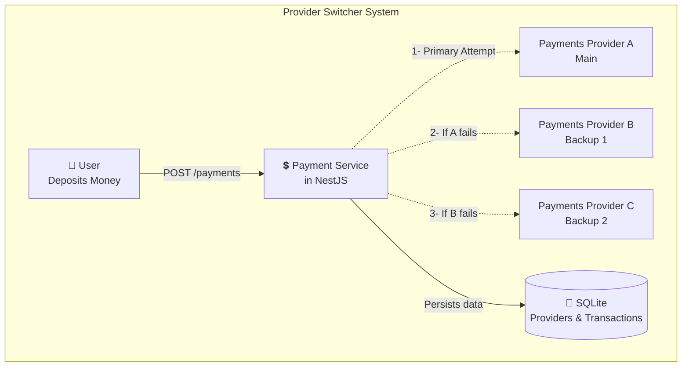
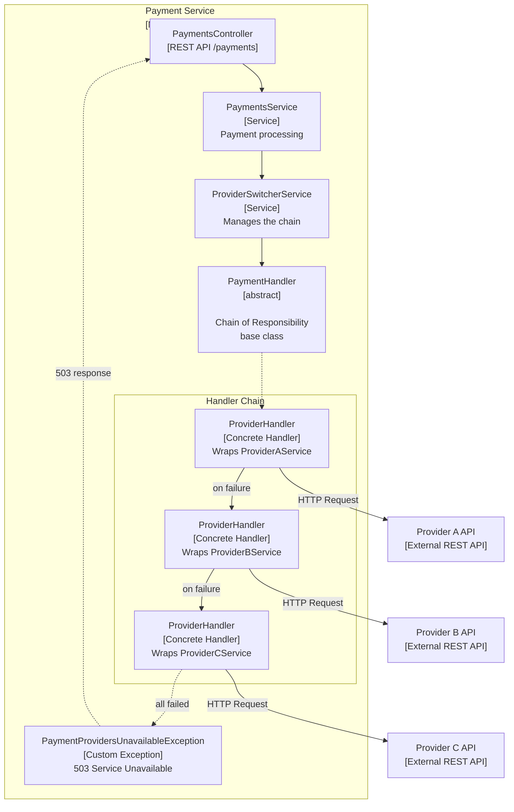
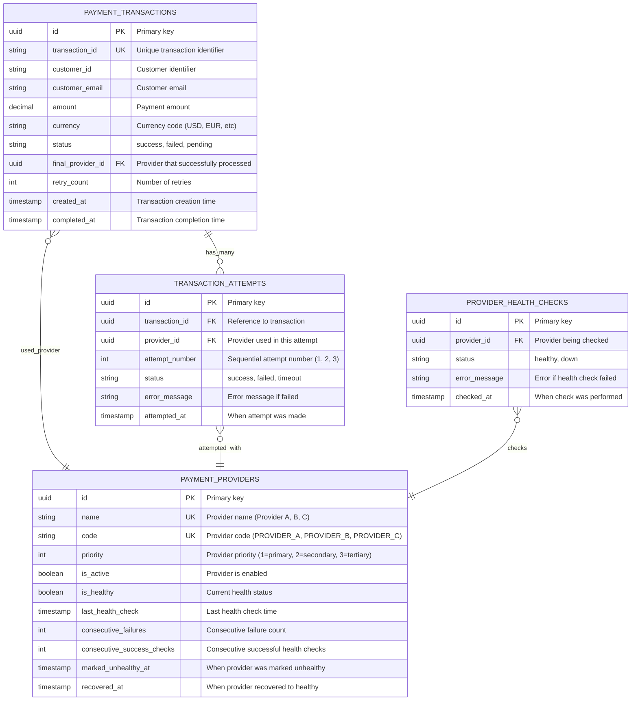

<p align="center">
  
</p>

# Payment Provider Switcher

A payment provider failover system with automatic retry logic and health monitoring.

## Intro

Manages multiple payment providers with intelligent failover, retry mechanisms, and health checks. When a provider fails, the system automatically switches to the next available provider.

## Features

- **Multi-provider support** - Seamlessly switch between providers
- **Retry logic** - Configurable retry attempts with exponential backoff
- **Structured logging** - Including level, metadata and context

## Tech Stack
- NestJS, TypeScript
- TypeORM + SQLite
- Mockoon for MockAPI
- Axios for HTTP requests
- Jest for testing

## Architecture


### Context Diagram

Shows the system's interaction with users and external payment providers.


### Containers Diagram

Responsibility Pattern: Each ProviderHandler wraps a provider service and automatically passes failed requests to the next handler in the chain. If all providers fail, a custom exception returns a 503 Service Unavailable response.



### Design Patterns and Best Practices

The implementation leverages proven architectural patterns:
- **Chain of Responsibility** - Sequential provider fallback handling
- **Dependency Injection** - Loose coupling and testability via NestJS
- **Repository Pattern** - Data access abstraction with TypeORM
- **Retry with exponential backoff** - Resilient HTTP request handling
- **Custom logger implementation** - Structured logging with context

## Setup

```bash
npm install
npm start:dev
```

## Testing

### Unit Tests
Tests for individual services, utilities, and components:
```bash
npm test                # Run all unit tests
npm run test:watch      # Run tests in watch mode
npm run test:cov        # Run tests with coverage report
```


## Provider Response Matrix

Simulates real-world API behavior across providers. Each provider returns different responses on consecutive calls to test failover scenarios and retry logic.

| Provider | Endpoint | Response 1 | Response 2 | Response 3 |
|----------|----------|------------|------------|------------|
| Provider A | /api/v1/payments | 200 - Approved | 500 - Internal Server Error | 504 - Gateway Timeout |
| Provider B | /payments | 200 - Approved | 429 - Rate Limit Exceeded | 503 - Service Unavailable |
| Provider C | /payments | 200 - OK | 401 - Unauthorized | 429 - Too Many Requests |

## Future Enhancements

- **Configuration** - Mock API response distribution, retry mechanism
- **Data persistence** - Store transaction history and provider metrics
  - Entity Relation Diagram for database schema
  


- **Circuit breaker pattern** - Automatic health check, provider recovery and self-healing capabilities
- **Provider weighting** - Priority-based routing

## License

MIT License
